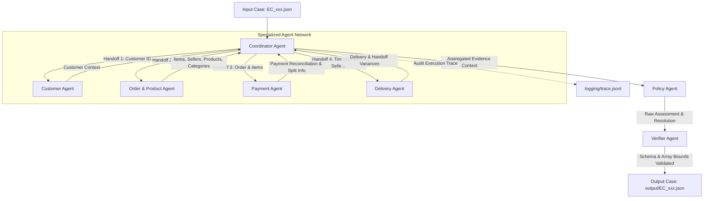

# Multi-Agent E-commerce Dispute Resolution System Architecture

Dự án này triển khai hệ thống **Multi-Agent E-commerce Dispute Resolution** tự động điều tra khiếu nại khách hàng trên dữ liệu thương mại điện tử Olist (Brazil) theo bộ quy tắc nghiệp vụ **`EC_POLICY_V2`**.

---

## 1. Sơ đồ kiến trúc tổng thể (Multi-Agent Flow)

---

## 2. Danh sách Agent, Vai trò và Quyền truy cập dữ liệu

| Agent Name | Vai trò & Trách nhiệm chính | Quyền truy cập dữ liệu (Data Access) |
| :--- | :--- | :--- |
| **Coordinator Agent** | Nhận khiếu nại, điều phối luồng gọi các Specialist Agent, tổng hợp ngữ cảnh và lưu vết `trace.jsonl`. | Tệp input/output JSON, `logging/trace.jsonl` |
| **Customer Agent** | Nhận diện khách hàng (`customer_unique_id`), trích xuất lịch sử order liên quan (`related_order_ids`). | `olist_customers_dataset.csv`, `olist_orders_dataset.csv` |
| **Order & Product Agent** | Phân tích danh sách sản phẩm, gian hàng (`seller_id`), mã item và danh mục sản phẩm. | `olist_order_items_dataset.csv`, `olist_products_dataset.csv`, `product_category_name_translation.csv` |
| **Payment Agent** | Tổng hợp dòng thanh toán, tính tổng tiền hàng + phí ship, kiểm tra đối soát (`reconciled`) và split payment. | `olist_order_payments_dataset.csv`, dữ liệu items từ OrderProductAgent |
| **Delivery Agent** | So sánh mốc thời gian giao hàng thực tế vs dự kiến (`delivery_variance_hours`), kiểm tra SLA bàn giao seller (`shipping_limit_date`). | `olist_orders_dataset.csv`, `olist_order_items_dataset.csv` |
| **Policy Agent** | Áp dụng bộ quy tắc `EC_POLICY_V2`: xác định Primary Issue, Secondary Issues, Root Cause, Bên chịu trách nhiệm, Refund & Actions. | Rules Engine (`EC_POLICY_V2`), Aggregated Context |
| **Verifier Agent** | Kiểm định toàn bộ dữ liệu đầu ra: validate JSON schema, giới hạn kích thước mảng, định dạng Evidence ID và null constraints. | Output JSON Schema, Final Draft Object |

---

## 3. Quy trình Handoff giữa các Agent

1. **Phase 1: Trigger & Investigation Scope**
   - `Coordinator Agent` tiếp nhận `EC_xxx.json`, đọc `claimed_order_id` và truy vấn bảng orders chính.
2. **Phase 2: Parallel/Sequential Domain Analysis**
   - **Handoff 1**: `Coordinator` gửi `customer_id` sang `CustomerAgent` để tra cứu `customer_unique_id` và lịch sử order mua lặp lại.
   - **Handoff 2**: `Coordinator` gửi `claimed_order_id` sang `OrderProductAgent` để lấy danh sách item, seller, product ID, category name.
   - **Handoff 3**: `Coordinator` chuyển dữ liệu items sang `PaymentAgent` để tính toán tổng giá trị đơn vị BRL, tính `difference_brl` và trạng thái `reconciled` (sai số <= 0.10 BRL).
   - **Handoff 4**: `Coordinator` gửi thông tin thời gian sang `DeliveryAgent` để tính `delivery_variance_hours` và `handoff_variance_hours` của từng seller.
3. **Phase 3: Policy Assessment & Evidence Generation**
   - **Handoff 5**: `Coordinator` chuyển toàn bộ kết quả phân tích sang `PolicyAgent`. `PolicyAgent` duyệt theo thứ tự ưu tiên nghiệp vụ `EC_POLICY_V2`:
     1. `canceled_order_paid`
     2. `unavailable_order_paid`
     3. `late_delivery_seller`
     4. `late_delivery_logistics`
     5. `valid_split_payment`
     6. `unsupported_late_claim`
   - `PolicyAgent` xác định các Secondary Issues (`multi_item_order`, `multi_seller_order`, `split_payment`, `repeat_customer`, `multiple_categories`), tính khoản hoàn tiền BRL và tạo danh sách `evidence_ids` hợp lệ (`order:`, `item:`, `payment:`, `seller:`, `policy:`).
4. **Phase 4: Verification & Persistence**
   - **Handoff 6**: `Coordinator` chuyển kết quả sang `VerifierAgent` để loại bỏ các trường không hợp lệ, ép mảng theo đúng giới hạn tối đa (ví dụ: max 5 actions, max 20 evidence IDs), đảm bảo `confidence` trong khoảng `[0, 1]`.
   - `Coordinator Agent` ghi kết quả verified vào file `output/EC_xxx.json` và lưu vết step trace vào `logging/trace.jsonl`.
